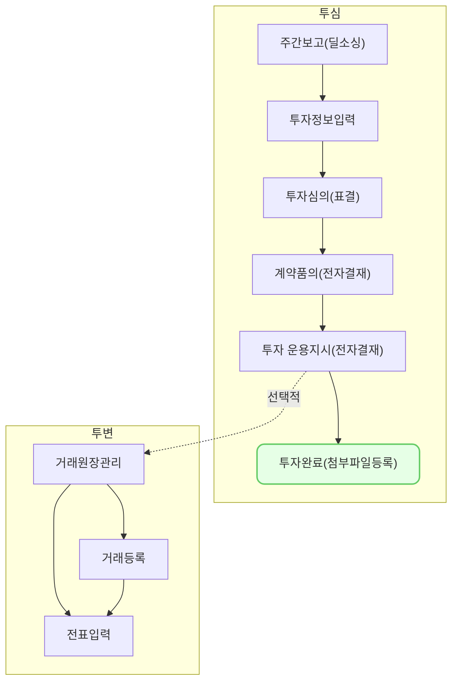

투자심의의 첨부파일 등록은,\
IR자료, Term Sheet부터 주주명부 등\
**투자심의 과정에서 필요한 파일들을 첨부, 보관**하기 위한 기능 입니다.

## 투어 가이드

<iframe src="https://app.supademo.com/embed/cmfuf8p0c1dil10k8nq6mpyqe?embed_v=2&utm_source=embed" loading="lazy" title="VCworks 투자심의 - 첨부파일 탭" allow="clipboard-write" frameborder="0" webkitallowfullscreen="true" mozallowfullscreen="true" allowfullscreen style="position: absolute; top: 0; left: 0; width: 100%; height: 100%;"></iframe>

## 설명
> 첨부파일 기능은 특별한 조건없이 사용이 가능합니다. 
{: .prompt-tip }

### 파일 첨부
1. [첨부파일] 탭으로 이동
2. [수정] 버튼 클릭
3. 첨부할 파일의 [파일 선택] 클릭
4. 로컬에서 파일 선택
5. [저장] 버튼 클릭
6. **파일 첨부 완료**

## 자주 묻는 질문
> 1. 필수 파일을 변경하고 싶어요!
> 2. 서류명을 변경할 수 있나요?
{: .prompt-tip }

- 특정 서류의 첨부 필수 여부, 서류명을 변경하고 싶은 경우, \
[투자/회수] - [설정] - [투자 심의 설정] 메뉴의 [첨부파일 목록 설정]에서 변경하실 수 있습니다.

## 선후행 구조도

