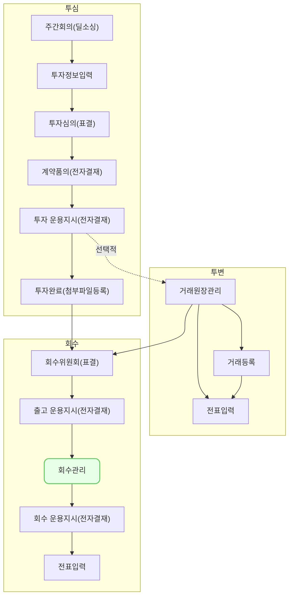

회수 관리 (ex0007)에서는 투자 내역별로 발생한 회수 거래를 VCworks에 등록하는 방법을 설명합니다.

## 데모 가이드

## 회수 관리 요약
- `투자/회수-회수 관리`에서는 회수 거래를 등록하거나 회수가 완료된 투자건에 대한 추가 회수 내역을 등록할 수 있습니다.
- 투자 내역을 2개 이상 선택한 경우, 선택한 투자 내역에 대한 거래를 연달아서 입력할 수 있습니다.

> 회수위원회 사용 여부가 `사용`이고 회수위원회가 `가결`된 포트폴리오에 대해서만 회수 거래를 등록할 수 있습니다.
{: .prompt-tip }

> 회수유형 `기타회수`는 회수가 완료되어 잔액이 0원인 투자건에 대해 추가 회수금이 발생했을 때 등록할 수 있는 거래입니다. 
{: .prompt-tip }

## 회수 거래 등록하기

1. 우측 상단 `신규 등록` 버튼을 클릭해주세요.
2. 회수 거래 등록 모달에서 `거래일`, `회수유형`, `포트폴리오`를 선택한 다음, 회수 거래를 등록할 투자 내역을 선택해주세요.
3. 처분구분과 매수자 정보를 입력해주세요.
4. 선택한 투자 거래의 투자 유형에 따라 회수 내역 입력 방식이 아래와 같습니다.
	- 1.주식인 경우: `총 회수금액`과 `회수 주식 수`를 입력하면 `회수원금`과 `회수손익`이 자동으로 계산됩니다.
	- 주식 외: `총 회수금액`과 `회수원금`을 입력하면 `회수손익`이 자동으로 계산됩니다.
5. 투자통화와 조합통화가 다른 경우 `환산 회수 내역`을 입력해야 합니다.
	- 조합통화 기준으로 회수 내역의 금액이 얼마인지 입력할 수 있습니다.
	- `총 환산 회수금액`을 입력하면 자동으로 나머지 값이 계산됩니다.
6. LP보고를 사용하는 경우 `처분구분(LP보고)`를 선택해주세요.
7. 모든 정보를 입력한 뒤 우측 상단의 `저장` 버튼을 클릭해 회수 거래를 등록해주세요.
	- 선택한 투자 조건으로 발생한 회수 거래 내역이 저장됩니다.
	- 동시에 다음으로 선택한 투자 조건에 대한 거래 내역 등록 화면이 제공됩니다.
	- 만약 거래 등록이 필요 없는 투자 조건을 잘못 선택했다면, `내역에서 제외`버튼으로 다음 투자 조건의 거래 화면으로 넘어갈 수 있습니다.
8. `회수 거래 등록 모달`에서 투자 조건을 2개 이상 선택했다면, 선택한 모든 투자 조건에 대해 1~7을 반복 진행해 주세요.

> 회수유형이 `기타회수`인 경우 투자 잔액이 `0`인 투자 내역만 선택할 수 있습니다. 
> 등록하는 방법은 회수 거래와 동일하며 회수 완료 이후에 발생한 회수 금액에 대한 거래를 입력하는 용도로 사용할 수 있습니다.
{: .prompt-tip }

## 회수 거래 내역 수정하기
1. `투자/회수-회수 관리`에서 수정을 원하는 행을 클릭해 주세요.
2. 우측 상단 `수정` 버튼을 클릭해주세요.
3. 수정을 원하는 정보를 입력하신 후, `저장`버튼을 클릭해 주세요.

> 회수 거래 등록 후 생성된 운용지시서가 승인된 경우 정보를 수정할 수 없습니다.
{: .prompt-warning }

> 회수유형이 `기타회수`인 경우 투자 잔액이 `0`인 투자 내역만 선택할 수 있습니다. 
> 등록하는 방법은 회수 거래와 동일하며 회수 완료 이후에 발생한 회수 금액에 대한 거래를 입력하는 용도로 사용할 수 있습니다.
{: .prompt-tip }

## 자주 묻는 질문

> 회수 거래 등록/수정이 안됩니다.
{: .prompt-tip }
- 등록/수정 직전의 투자잔액을 확인해주세요.
- 투자 잔액 이상의 원금을 차감하는 거래는 등록할 수 없습니다.
- 이전에 등록한 거래를 수정하는 경우에도 마찬가지로 수정 사항이 투자 잔액 이상의 원금을 차감하는 경우 수정할 수 없습니다.

> 회수 거래 등록 시에는 거래일, 포트폴리오, 투자 조건을 변경할 수 없나요?
{: .prompt-tip }
- `거래 등록` 모달에서 선택한 거래일, 거래 유형, 포트폴리오, 투자 조건은 등록 화면에서 수정이 불가능합니다.
- 해당 항목의 수정을 원하시면, 브라우저 새로고침 후, 거래 등록 프로세스를 재진행해 주세요.

> 회수 거래일, 포트폴리오, 투자 조건을 수정하고 싶습니다.
{: .prompt-tip }
- 이미 등록한 거래 내역의 거래일, 거래 유형, 포트폴리오, 투자 조건은 수정이 불가능합니다.
- 해당 항목의 수정을 원하시면, 삭제 후 신규 등록해 주세요.

## 선후행 구조도

