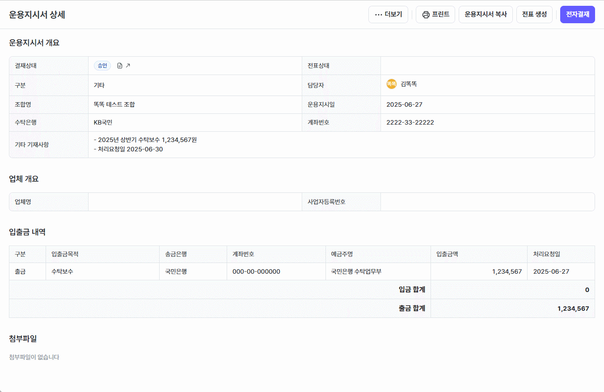

### 공통 사항
- `설정 > 사용자 정의 항목 관리`에서 사용자가 추가로 입력하기를 원하는 항목 및 필수값을 설정할 수 있게 되었습니다.
	- 회사 정보(투자심의, 포트폴리오), 투자 심의 기타투자정보, 조합 정보, 조합원 정보
		
	- 투자 심의 회사 정보 및 기타투자정보의 필수값 설정은 `투자/회수 > 투자 심의 설정 > 단계별 필수값 설정`에서 단계별 필수값을 수정할 수 있습니다. 
- 기타 버그를 수정하고 시스템의 안정성을 개선하였습니다.
### 운용지시서 개선 사항
- 운용지시서 품의 결재가 완료(승인, 반려)된 운용지시서를 수정하거나 품의를 재상신할 수 있는 기능이 추가되었습니다.
	- 결재 완료된 운용지시서를 수정하면 기존 결재 완료 품의는 취소 처리됩니다.
		
	- 결재 완료된 운용지시서에서 [전자결재] 버튼을 클릭하면 품의를 재상신할 수 있습니다.
		

### 회계/재무 개선 사항
- `회계/재무 > 거래처 잔액 조회`에서 아래와 같이 계정과목의 잔액을 조회할 수 있습니다.
	- 거래처별 계정과목의 잔액을 조회할 수 있습니다.
		
	- 거래처의 모든 계정과목의 잔액을 조회할 수 있습니다.	 
		
	- 계정별 원장 검색 조건에 거래처가 추가되었습니다.
		
- 금융정보관리에 계좌 등록 시 회계 원장 정보가 없어도 계좌 정보를 등록할 수 있게 되었습니다.

### 포트폴리오 개선 사항
- `포트폴리오 > 포트폴리오 정보`에서 각 포트폴리오 별 변경 이력을 조회할 수 있게 되었습니다.
	- 회사 정보, 주요 연락처의 일자별 변경 이력을 확인할 수 있습니다.
		
- STworks를 가입하지 않은 포트폴리오에 일괄 초대를 전송할 수 있는 기능이 추가되었습니다.
	- `포트폴리오 > 포트폴리오 연락망`에서 가입 초대를 보내고 싶은 연락처를 선택한 뒤 [STworks 초대]버튼을 클릭해주세요.
		
	- STworks 초대 전송 이력과 포트폴리오 읽음 여부를 확인할 수 있습니다.
		
- 법인 등기부 등본을 발급받은 뒤 변동된 정보를 거래 원장 관리 총발행주식수 변경 유형으로 바로 등록할 수 있는 기능이 추가되었습니다.
	

### 투자 심의 개선 사항
- `투자/회수 > 투자 심의 설정 > 단계별 필수값 설정`에서 투자 심의 단계별 필수값을 사용자화할 수 있습니다.
	- 단계별 필수 값이 해당 단계에 도달했을 때 필수 표시`(*)`가 되도록 수정되었습니다.
	
- 투자 심의 [첨부파일] 탭 UI가 더욱 편리하게 첨부파일을 조회할 수 있도록 개선되었습니다.
	
- `투자/회수 > 투자 심의 설정 > 첨부 파일 목록 설정`에서 첨부 파일 목록 및 항목별 필수값 여부를 사용자화할 수 있습니다.
	
- 투자 심의 [첨부파일] 탭 내 한 항목에 여러 첨부파일을 업로드할 수 있도록 개선되었습니다.
	
- 그 외 본계정 투자 및 조합출자금 유형 투자 시 실무를 더 잘 반영할 수 있도록 로직이 개선되었습니다.

### 거래원장관리 개선 사항
- 거래 원장 등록 화면의 입력 사용성이 개선되었습니다.
- 누적회수금액 산출 방식이 기타수익, 이자, 현금배당, 본계정인수 거래 유형과 외환차손익을 반영할 수 있도록 변경되었습니다.

### 회수 개선 사항
- 회수 위원회 및 회수 관리의 입력 사용성이 개선되었습니다.

### 의결 개선 사항
- 의결 결과 정보 반영 시 유상증자 안건의 경우 가치평가를 등록할 수 있게 되었습니다.
- 안건 별로 순차적으로 정보 반영을 할 수 있도록 개선되었습니다.
	![[VCW_120_SA_0.png]]

### BI 개선 사항
- 담당심사역 발굴/심사/사후관리 기여율을 합친 총 기여율 컬럼이 추가되었습니다.
- 발굴/심사/사후관리 기여율 컬럼이 조합 성과율을 반영할 수 있도록 수정되었습니다.
- VCworks의 항목명과 동일한 값이나 다른 이름으로 작성되어 있던 BI 컬럼명이 수정되었습니다.

### 관리자 기능 개선 사항
- `설정 > 사용자 작업 이력 조회`에서 사용자의 활동 이력을 조회할 수 있는 기능이 추가되었습니다. (관리자 권한만 조회 가능)
	- 로그인 및 로그아웃
	- 주요 정보(조합원, 임직원 등) 조회 및 수정
	- 역할 및 권한 변경
	- 파일 다운로드 및 첨부파일 조회
	- 인쇄 미리보기 및 엑셀 내보내기
	