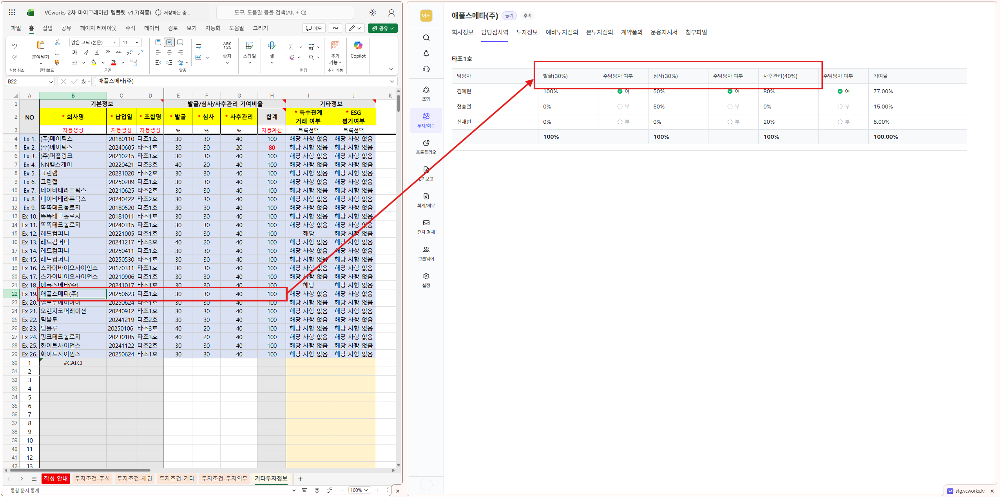
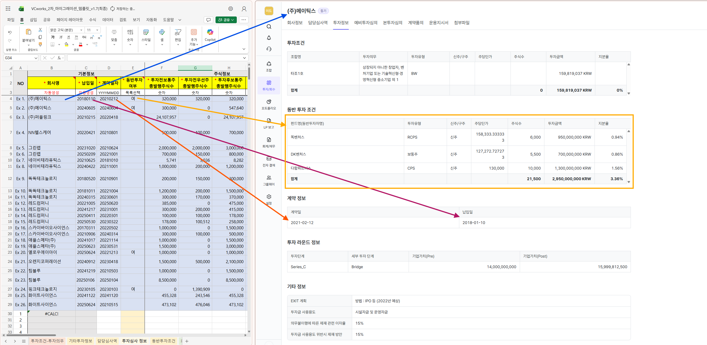
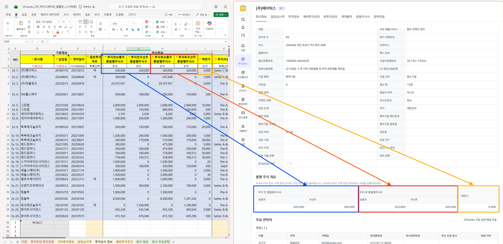

## 1. 목적
본 문서는 2차 마이그레이션이 완료된 시점에서 고객이 Excel 양식에 입력한 데이터를 VCworks 화면 내에서 확인 하는 방법을 안내 하기 위해 작성된 문서입니다.

## 2. 검수 기준
2차 마이그레이션은 투자심의 데이터를 이관하는 과정입니다. 따라서, 투자심의 건 단위로 검수가 필요합니다. 
### 2-1. 투자심의 식별 데이터
투자심의는 아래의 데이터 묶음으로 식별이 가능합니다.
 - 회사명
 - 납입일
## 3. 검수 절차

### 3-0. 로그인/조회 페이지 이동
1. VCworks 로그인
2. 투자/회수 > `투자 심의` 메뉴 클릭
3. 좌측 상단 `전체` 탭 클릭 (완료)

### 3-1. `투자조건` 시트 내용 검수
1. 검수 대상 투자심의 건 클릭
	1. 
	2. 2차 마이그레이션 Excel 템플릿 B,C열에 기재되어 있는 `회사명 - 납입일` 이 일치 하는 것을 기준으로 식별 합니다
2. `투자정보` 탭 클릭
	1. 
	2. 2차 마이그레이션 Excel 템플릿 [투자조건 - 주식],[투자조건 - 채권],[투자조건 - 기타],[투자조건 - 투자의무]는 모두 위 스크린샷의 투자정보 테이블에서 조회가 가능합니다.
3. `투자조건`행 클릭
	1. 
	2. ①영역에서 아래의 2차 마이그레이션 Excel 템플릿 기재 내용 확인이 가능합니다.
		1. [투자조건 - 주식] 시트의 B~J열 데이터
		2. [투자조건 - 채권] 시트의 B~R열 데이터
		3. [투자조건 - 기타] 시트의 전체 데이터 ※`세부 투자 유형`에 따라서 구성 항목이 달라집니다.
	3. ②영역에서 아래의 2차 마이그레이션 Excel 템플릿 기재 내용 확인이 가능합니다.
		1. [투자조건 - 투자의무] 시트의 전체
	4. ③영역에서 아래의 2차 마이그레이션 Excel 템플릿 기재 내용 확인이 가능합니다.
		1. [투자조건 - 주식] 시트의 K~AW 열 데이터 ※`세부 투자 유형`에 따라서 구성 항목이 달라집니다.
		2. [투자조건 - 채권] 시트의 S~BF 열 데이터 ※`세부 투자 유형`에 따라서 구성 항목이 달라집니다.
### 3-2. `기타투자정보` 시트 내용 검수
#### 3-2-0. `발굴/심사/사후관리 기여비율` 검수
1. `담당심사역` 탭 클릭
2. 각각 설정된 기여비율에 대해서 확인
	1. 
	2. 기여비율이란?
		1. 투자 심사역의 성과 영역을 `발굴-심사-사후관리` 3개의 영역으로 나누었을때 각각 성과의 비중을 나타내는 비율입니다.

#### 기타정보란?
`기타정보`란 VICS 시스템 보고 연동을 위해서 마련된 시스템 코드로 투자심의가 완료되지 않은 상태에서 필수 기재 사항으로 설정되어 있지만, 현재로써는 투자완료 상태에서는 조회가 지원되고 있지 않으므로, 당사에서 별도로 검수를 진행합니다.

### 3-3. `담당심사역` 시트 내용 검수
1. `담당심사역`탭 클릭
2. `회사명-납입일-조합`을 기준으로 각각 기재 내용이 정상 이관되었는지 확인
	1. 
### 3-4. `투자심사 정보` 시트 내용 검수
#### 3-4-0. 기본정보 섹션 (B~E열)
1. `투자정보` 탭 클릭
2. 데이터  확인
	1. 
	2. ※E열의 `동반투자여부` 데이터는 VCworks 화면 기준 동반 투자 조건 영역에 등록 내용이 1개라도 있으면 `여` 아무 등록 사항이 없다면 `부` 입니다.
#### 3-4-1. 주식정보 (F~J열)
1. `회사정보` 탭 클릭
2. 데이터 확인
	1. 
#### 3-4-2.투자라운드정보 (K~M열)
1. `투자정보` 탭 클릭
2. 데이터 확인
	1. 
### 3-5. `동반투자조건` 시트 내용 검수
1. `투자정보`탭 클릭
2. 동반 투자 조건 클릭
3. 동반 투자 조건 섹션의 데이터 확인
	1. 
### 3-6. `회사정보` 시트 내용 검수
1. `회사정보` 탭 클릭
2. 회사 정보 섹션의 데이터 확인
	1. 
### 3-7. `회사 주요연락처` 시트 내용 검수
1. `회사정보`탭 클릭
2. 주요 연락처 섹션의 데이터 확인
	1. 
