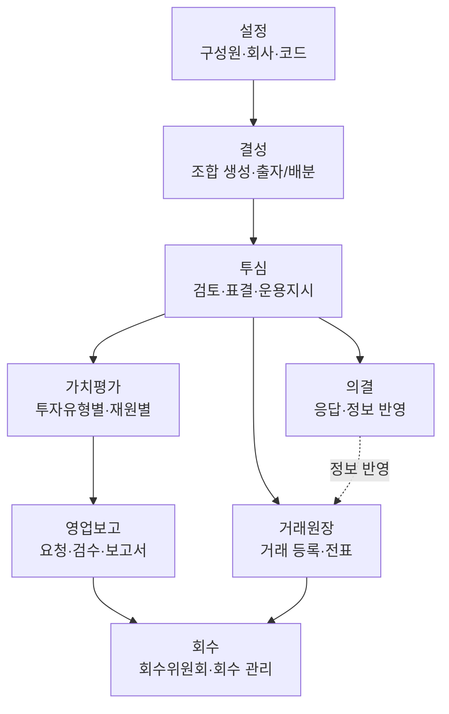

  <a href="/associate-start/" class="guide-card">
    <i class="fas fa-user-shield"></i>
    심사역으로 시작하기
  </a>
  <a href="/manager-start/" class="guide-card">
    <i class="fas fa-user"></i>
    관리역으로 시작하기
  </a>
  <a href="/features/" class="guide-card">
    <i class="fas fa-book"></i>
    각 기능별 매뉴얼
  </a>

---

VCworks.kr은 똑똑[^dkdk] 주식회사에서 만든 대한민국 Venture Capital ERP Solution입니다.   

## VC업무의 일반 흐름

VCworks는 **설정 → 결성 → 투심**을 거쳐 투자한 자산을 **가치평가·거래원장·의결**로 운영하고, **영업보고·회수**로 마무리하는 구조입니다. 각 단계를 클릭하면 해당 영역의 대표 화면으로 이동할 수 있습니다.

> 역할별로 화면 단위의 세부 흐름이 필요하면 **[심사역으로 시작하기](/associate-start/)** 또는 **[관리역으로 시작하기](/manager-start/)** 페이지를 참고해주세요. 각 기능의 단독 매뉴얼은 **[각 기능별 매뉴얼](/features/)**에서 찾을 수 있습니다.

버그 및 문의 사항은 다음 이메일로 보내주세요: **[we@dkdk.kr](mailto:we@dkdk.kr)**

---

[^dkdk]:똑똑(dkdk.kr)은 대한민국 벤처투자전문회사인 DSC인베스트먼트가 VC업계의 업무 방식을 혁신하고자 만든 IT자회사입니다. 
