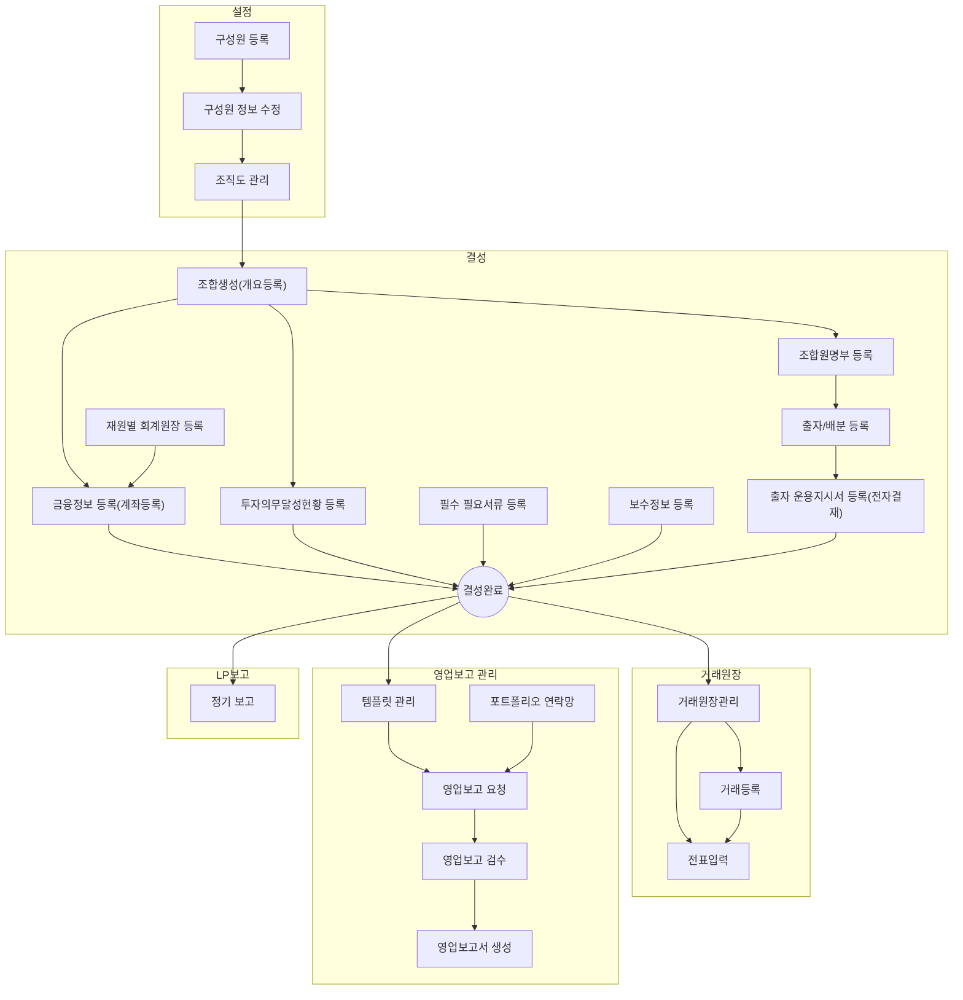

관리역(Manager)은 VCworks에서 조합 결성, 회계/재무, LP보고, 영업보고 관리 등 운영 전반을 담당하는 사용자입니다.
아래 가이드를 통해 주요 업무를 빠르게 시작해보세요.

## 빠른 시작 가이드

  <a href="/posts/hr0001/" class="guide-card">
    <i class="fas fa-user-plus"></i>
    구성원 등록
  </a>
  <a href="/posts/fd0001/" class="guide-card">
    <i class="fas fa-folder-plus"></i>
    신규조합 추가
  </a>
  <a href="/posts/se0003/" class="guide-card">
    <i class="fas fa-user-cog"></i>
    역할/권한 관리
  </a>
  <a href="/posts/br0004/" class="guide-card">
    <i class="fas fa-clipboard-list"></i>
    영업보고 요청
  </a>
  <a href="/posts/lc0101/" class="guide-card">
    <i class="fas fa-file-export"></i>
    LP 정기 보고
  </a>

---

## 관리역 업무 흐름

- 다음의 항목을 클릭하여 관련 가이드로 바로 이동할 수 있습니다.

---

## 업무 영역별 상세 가이드

  

    
      <i class="far fa-folder-open fa-fw"></i>
      설정
    
    
      <i class="fas fa-fw fa-angle-down"></i>
    
  

  

    <ul class="list-group">
      <li class="list-group-item">
        <i class="far fa-file-alt fa-fw"></i>
        <a href="/posts/hr0001/" class="mx-2">구성원 등록</a>
      </li>
      <li class="list-group-item">
        <i class="far fa-file-alt fa-fw"></i>
        <a href="/posts/hr0002/" class="mx-2">구성원 정보 수정</a>
      </li>
      <li class="list-group-item">
        <i class="far fa-file-alt fa-fw"></i>
        <a href="/posts/hr0007/" class="mx-2">조직도 관리</a>
      </li>
      <li class="list-group-item">
        <i class="far fa-file-alt fa-fw"></i>
        <a href="/posts/se0005/" class="mx-2">사용자 관리</a>
      </li>
      <li class="list-group-item">
        <i class="far fa-file-alt fa-fw"></i>
        <a href="/posts/se0003/" class="mx-2">역할/권한 관리</a>
      </li>
      <li class="list-group-item">
        <i class="far fa-file-alt fa-fw"></i>
        <a href="/posts/cm0009/" class="mx-2">사용자 작업 이력 조회</a>
      </li>
      <li class="list-group-item">
        <i class="far fa-file-alt fa-fw"></i>
        <a href="/posts/ed0100/" class="mx-2">전자결재 - 빈품의서</a>
      </li>
    </ul>
  

  

    
      <i class="far fa-folder-open fa-fw"></i>
      조합 결성/관리
    
    
      <i class="fas fa-fw fa-angle-down"></i>
    
  

  

    <ul class="list-group">
      <li class="list-group-item">
        <i class="far fa-file-alt fa-fw"></i>
        <a href="/posts/fd0001/" class="mx-2">신규조합 추가</a>
      </li>
      <li class="list-group-item">
        <i class="far fa-file-alt fa-fw"></i>
        <a href="/posts/fd0010/" class="mx-2">투자 의무 등록</a>
      </li>
      <li class="list-group-item">
        <i class="far fa-file-alt fa-fw"></i>
        <a href="/posts/fd0011/" class="mx-2">조합원 명부 등록</a>
      </li>
      <li class="list-group-item">
        <i class="far fa-file-alt fa-fw"></i>
        <a href="/posts/fd0013/" class="mx-2">조합 결성 필요 서류</a>
      </li>
      <li class="list-group-item">
        <i class="far fa-file-alt fa-fw"></i>
        <a href="/posts/fd0012/" class="mx-2">보수 관리 정보 등록</a>
      </li>
      <li class="list-group-item">
        <i class="far fa-file-alt fa-fw"></i>
        <a href="/posts/fd0009a/" class="mx-2">금융정보 등록 (계좌등록)</a>
      </li>
      <li class="list-group-item">
        <i class="far fa-file-alt fa-fw"></i>
        <a href="/posts/fm0010/" class="mx-2">재원별 회계원장 등록</a>
      </li>
      <li class="list-group-item">
        <i class="far fa-file-alt fa-fw"></i>
        <a href="/posts/fd0006/" class="mx-2">출자/배분 등록</a>
      </li>
      <li class="list-group-item">
        <i class="far fa-file-alt fa-fw"></i>
        <a href="/posts/oi0002/" class="mx-2">출자 운용지시서 상신 (전자결재)</a>
      </li>
      <li class="list-group-item">
        <i class="far fa-file-alt fa-fw"></i>
        <a href="/posts/pr0011/" class="mx-2">조합원 명부/출자 증서/출자 확인서 출력</a>
      </li>
      <li class="list-group-item">
        <i class="far fa-file-alt fa-fw"></i>
        <a href="/posts/fd0029/" class="mx-2">조합원 총회</a>
      </li>
      <li class="list-group-item">
        <i class="far fa-file-alt fa-fw"></i>
        <a href="/posts/fd0060/" class="mx-2">지분양도양수 등록</a>
      </li>
      <li class="list-group-item">
        <i class="far fa-file-alt fa-fw"></i>
        <a href="/posts/fd0004/" class="mx-2">투자 현황</a>
      </li>
      <li class="list-group-item">
        <i class="far fa-file-alt fa-fw"></i>
        <a href="/posts/fd0100/" class="mx-2">수익률 관리</a>
      </li>
      <li class="list-group-item">
        <i class="far fa-file-alt fa-fw"></i>
        <a href="/posts/fd0200/" class="mx-2">조합원 소득공제</a>
      </li>
    </ul>
  

  

    
      <i class="far fa-folder-open fa-fw"></i>
      거래원장 관리
    
    
      <i class="fas fa-fw fa-angle-down"></i>
    
  

  

    <ul class="list-group">
      <li class="list-group-item">
        <i class="far fa-file-alt fa-fw"></i>
        <a href="/posts/pm0001/" class="mx-2">거래 원장 관리</a>
      </li>
      <li class="list-group-item">
        <i class="far fa-file-alt fa-fw"></i>
        <a href="/posts/pm0004/" class="mx-2">일반거래 등록/조회</a>
      </li>
      <li class="list-group-item">
        <i class="far fa-file-alt fa-fw"></i>
        <a href="/posts/pm0006/" class="mx-2">전환거래 등록/조회</a>
      </li>
      <li class="list-group-item">
        <i class="far fa-file-alt fa-fw"></i>
        <a href="/posts/pm0008/" class="mx-2">인수합병 거래 등록/조회</a>
      </li>
    </ul>
  

  

    
      <i class="far fa-folder-open fa-fw"></i>
      회계/재무
    
    
      <i class="fas fa-fw fa-angle-down"></i>
    
  

  

    <ul class="list-group">
      <li class="list-group-item">
        <i class="far fa-file-alt fa-fw"></i>
        <a href="/posts/fm0009/" class="mx-2">회계기준 및 회계원장</a>
      </li>
      <li class="list-group-item">
        <i class="far fa-file-alt fa-fw"></i>
        <a href="/posts/fm0010/" class="mx-2">재원별 회계원장</a>
      </li>
      <li class="list-group-item">
        <i class="far fa-file-alt fa-fw"></i>
        <a href="/posts/fm0005/" class="mx-2">계정과목</a>
      </li>
      <li class="list-group-item">
        <i class="far fa-file-alt fa-fw"></i>
        <a href="/posts/fm0011/" class="mx-2">재무제표 양식</a>
      </li>
      <li class="list-group-item">
        <i class="far fa-file-alt fa-fw"></i>
        <a href="/posts/fm0300/" class="mx-2">자동 전표 설정</a>
      </li>
      <li class="list-group-item">
        <i class="far fa-file-alt fa-fw"></i>
        <a href="/posts/fm0002/" class="mx-2">전표 입력</a>
      </li>
      <li class="list-group-item">
        <i class="far fa-file-alt fa-fw"></i>
        <a href="/posts/fm0003/" class="mx-2">분개장 조회</a>
      </li>
      <li class="list-group-item">
        <i class="far fa-file-alt fa-fw"></i>
        <a href="/posts/fm0021/" class="mx-2">전표 조회</a>
      </li>
      <li class="list-group-item">
        <i class="far fa-file-alt fa-fw"></i>
        <a href="/posts/fm0015/" class="mx-2">계정별 원장</a>
      </li>
      <li class="list-group-item">
        <i class="far fa-file-alt fa-fw"></i>
        <a href="/posts/fm0016/" class="mx-2">합계 잔액 시산표</a>
      </li>
      <li class="list-group-item">
        <i class="far fa-file-alt fa-fw"></i>
        <a href="/posts/fm0018/" class="mx-2">재무상태표</a>
      </li>
      <li class="list-group-item">
        <i class="far fa-file-alt fa-fw"></i>
        <a href="/posts/fm0017/" class="mx-2">손익계산서</a>
      </li>
      <li class="list-group-item">
        <i class="far fa-file-alt fa-fw"></i>
        <a href="/posts/fm0012/" class="mx-2">표준 계정 연결 관리</a>
      </li>
      <li class="list-group-item">
        <i class="far fa-file-alt fa-fw"></i>
        <a href="/posts/fm0019/" class="mx-2">마감/이월</a>
      </li>
      <li class="list-group-item">
        <i class="far fa-file-alt fa-fw"></i>
        <a href="/posts/fm0008/" class="mx-2">금융 정보 관리</a>
      </li>
      <li class="list-group-item">
        <i class="far fa-file-alt fa-fw"></i>
        <a href="/posts/fm0020/" class="mx-2">계좌잔액 조회</a>
      </li>
      <li class="list-group-item">
        <i class="far fa-file-alt fa-fw"></i>
        <a href="/posts/fm0100/" class="mx-2">법인 카드 관리</a>
      </li>
      <li class="list-group-item">
        <i class="far fa-file-alt fa-fw"></i>
        <a href="/posts/my0200/" class="mx-2">내 법인 카드 사용 내역</a>
      </li>
    </ul>
  

  

    
      <i class="far fa-folder-open fa-fw"></i>
      영업보고 관리
    
    
      <i class="fas fa-fw fa-angle-down"></i>
    
  

  

    <ul class="list-group">
      <li class="list-group-item">
        <i class="far fa-file-alt fa-fw"></i>
        <a href="/posts/br0001/" class="mx-2">영업보고 템플릿</a>
      </li>
      <li class="list-group-item">
        <i class="far fa-file-alt fa-fw"></i>
        <a href="/posts/br0012/" class="mx-2">포트폴리오 연락망</a>
      </li>
      <li class="list-group-item">
        <i class="far fa-file-alt fa-fw"></i>
        <a href="/posts/br0004/" class="mx-2">영업보고 요청</a>
      </li>
      <li class="list-group-item">
        <i class="far fa-file-alt fa-fw"></i>
        <a href="/posts/br0007/" class="mx-2">영업보고 검수</a>
      </li>
      <li class="list-group-item">
        <i class="far fa-file-alt fa-fw"></i>
        <a href="/posts/br0008/" class="mx-2">영업보고 AI 검수</a>
      </li>
      <li class="list-group-item">
        <i class="far fa-file-alt fa-fw"></i>
        <a href="/posts/br0011/" class="mx-2">영업보고서 생성</a>
      </li>
    </ul>
  

  

    
      <i class="far fa-folder-open fa-fw"></i>
      LP보고
    
    
      <i class="fas fa-fw fa-angle-down"></i>
    
  

  

    <ul class="list-group">
      <li class="list-group-item">
        <i class="far fa-file-alt fa-fw"></i>
        <a href="/posts/lc0101/" class="mx-2">정기 보고</a>
      </li>
      <li class="list-group-item">
        <i class="far fa-file-alt fa-fw"></i>
        <a href="/posts/lp0531/" class="mx-2">운용기관 정보 보고</a>
      </li>
      <li class="list-group-item">
        <i class="far fa-file-alt fa-fw"></i>
        <a href="/posts/lp0270/" class="mx-2">상장 주식 거래</a>
      </li>
      <li class="list-group-item">
        <i class="far fa-file-alt fa-fw"></i>
        <a href="/posts/lp0310/" class="mx-2">투자 기업 부가 정보</a>
      </li>
      <li class="list-group-item">
        <i class="far fa-file-alt fa-fw"></i>
        <a href="/posts/lp0520/" class="mx-2">운용기관 인력정보</a>
      </li>
      <li class="list-group-item">
        <i class="far fa-file-alt fa-fw"></i>
        <a href="/posts/lp0510/" class="mx-2">투자기업 신청정보</a>
      </li>
      <li class="list-group-item">
        <i class="far fa-file-alt fa-fw"></i>
        <a href="/posts/lp0630/" class="mx-2">투자심사 보고</a>
      </li>
      <li class="list-group-item">
        <i class="far fa-file-alt fa-fw"></i>
        <a href="/posts/lp0600/" class="mx-2">담당심사역 이력</a>
      </li>
      <li class="list-group-item">
        <i class="far fa-file-alt fa-fw"></i>
        <a href="/posts/lp0590/" class="mx-2">수시 보고</a>
      </li>
      <li class="list-group-item">
        <i class="far fa-file-alt fa-fw"></i>
        <a href="/posts/lp0550/" class="mx-2">조합원 총회</a>
      </li>
      <li class="list-group-item">
        <i class="far fa-file-alt fa-fw"></i>
        <a href="/posts/lp0610/" class="mx-2">출자금 납입 요청 계획</a>
      </li>
      <li class="list-group-item">
        <i class="far fa-file-alt fa-fw"></i>
        <a href="/posts/lp0635/" class="mx-2">투자 계약서 보고</a>
      </li>
      <li class="list-group-item">
        <i class="far fa-file-alt fa-fw"></i>
        <a href="/posts/lp0681/" class="mx-2">액셀러레이터 보고</a>
      </li>
      <li class="list-group-item">
        <i class="far fa-file-alt fa-fw"></i>
        <a href="/posts/lp0570/" class="mx-2">관리보수/성과보수</a>
      </li>
      <li class="list-group-item">
        <i class="far fa-file-alt fa-fw"></i>
        <a href="/posts/lp0620/" class="mx-2">반기 보고</a>
      </li>
      <li class="list-group-item">
        <i class="far fa-file-alt fa-fw"></i>
        <a href="/posts/lc0100/" class="mx-2">보고 전송 내역 조회</a>
      </li>
      <li class="list-group-item">
        <i class="far fa-file-alt fa-fw"></i>
        <a href="/posts/lp0001/" class="mx-2">재원별 보고 LP 설정</a>
      </li>
    </ul>
  

---

> 관리역 권한이 부여되지 않은 경우, 일부 메뉴가 보이지 않을 수 있습니다.
> 역할/권한 설정은 [역할/권한 관리 가이드](/posts/se0003/)를 참고하세요.
{: .prompt-tip }

> 회계 기준 및 계정과목 설정은 조합 결성 전에 미리 완료하는 것을 권장합니다.
> [회계기준 및 회계원장](/posts/fm0009/) 가이드를 참고하세요.
{: .prompt-info }

버그 및 문의 사항은 다음 이메일로 보내주세요: **[we@dkdk.kr](mailto:we@dkdk.kr)**
