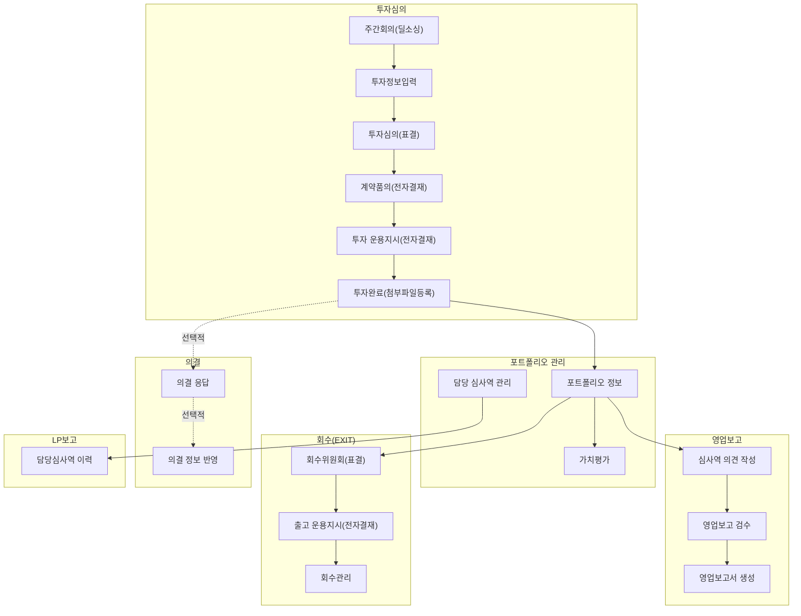

심사역(Reviewer)은 VCworks에서 투자의 전 과정 — 딜소싱, 투자심의, 포트폴리오 관리, 영업보고, 회수 — 을 담당하는 핵심 사용자입니다.
아래 가이드를 통해 주요 업무를 빠르게 시작해보세요.

## 빠른 시작 가이드

  <a href="/posts/vs_guide/" class="guide-card">
    <i class="fas fa-gavel"></i>
    투자심의 <small>전체 프로세스</small>
  </a>
  <a href="/posts/pm0300/" class="guide-card">
    <i class="fas fa-chart-line"></i>
    가치평가
  </a>
  <a href="/posts/br0009/" class="guide-card">
    <i class="fas fa-file-signature"></i>
    심사역 의견 <small>작성</small>
  </a>
  <a href="/posts/ex0001/" class="guide-card">
    <i class="fas fa-sign-out-alt"></i>
    회수(EXIT)
  </a>
  <a href="/posts/sa0002/" class="guide-card">
    <i class="fas fa-vote-yea"></i>
    의결 응답
  </a>

---

## 심사역 업무 흐름

- 다음의 항목을 클릭하여 관련 가이드로 바로 이동할 수 있습니다.

---

## 업무 영역별 상세 가이드

  

    
      <i class="far fa-folder-open fa-fw"></i>
      투자심의 (딜소싱 → 투자완료)
    
    <a href="#l_r0" data-bs-toggle="collapse" aria-expanded="false"
       aria-label="h_r0-trigger" class="category-trigger hide-border-bottom">
      <i class="fas fa-fw fa-angle-down"></i>
    </a>
  

  

    <ul class="list-group">
      <li class="list-group-item">
        <i class="far fa-file-alt fa-fw"></i>
        <a href="/posts/vs_guide/" class="mx-2"><strong>투자심의 이용 가이드 (전체 프로세스)</strong></a>
      </li>
      <li class="list-group-item">
        <i class="far fa-file-alt fa-fw"></i>
        <a href="/posts/wr0003/" class="mx-2">주간보고 (딜소싱)</a>
      </li>
      <li class="list-group-item">
        <i class="far fa-file-alt fa-fw"></i>
        <a href="/posts/vs0003/" class="mx-2">투자정보 입력</a>
      </li>
      <li class="list-group-item">
        <i class="far fa-file-alt fa-fw"></i>
        <a href="/posts/vs0006/" class="mx-2">예비투심/본투심 표결</a>
      </li>
      <li class="list-group-item">
        <i class="far fa-file-alt fa-fw"></i>
        <a href="/posts/ed0001a/" class="mx-2">계약품의 및 전자결재</a>
      </li>
      <li class="list-group-item">
        <i class="far fa-file-alt fa-fw"></i>
        <a href="/posts/oi0003/" class="mx-2">투자 운용지시 및 전자결재</a>
      </li>
      <li class="list-group-item">
        <i class="far fa-file-alt fa-fw"></i>
        <a href="/posts/vs0009/" class="mx-2">투자완료 첨부파일</a>
      </li>
      <li class="list-group-item">
        <i class="far fa-file-alt fa-fw"></i>
        <a href="/posts/vs_foreign/" class="mx-2">해외(외화) 투자 가이드</a>
      </li>
    </ul>
  

  

    
      <i class="far fa-folder-open fa-fw"></i>
      포트폴리오 관리
    
    <a href="#l_r1" data-bs-toggle="collapse" aria-expanded="false"
       aria-label="h_r1-trigger" class="category-trigger hide-border-bottom">
      <i class="fas fa-fw fa-angle-down"></i>
    </a>
  

  

    <ul class="list-group">
      <li class="list-group-item">
        <i class="far fa-file-alt fa-fw"></i>
        포트폴리오 정보
      </li>
      <li class="list-group-item">
        <i class="far fa-file-alt fa-fw"></i>
        <a href="/posts/pm0300/" class="mx-2">가치평가</a>
      </li>
      <li class="list-group-item">
        <i class="far fa-file-alt fa-fw"></i>
        <a href="/posts/pm0301/" class="mx-2">가치평가 등록 (비상장/투자유형별)</a>
      </li>
      <li class="list-group-item">
        <i class="far fa-file-alt fa-fw"></i>
        <a href="/posts/pm0302/" class="mx-2">가치평가 등록 (재원별)</a>
      </li>
      <li class="list-group-item">
        <i class="far fa-file-alt fa-fw"></i>
        <a href="/posts/pm0303/" class="mx-2">가치평가 조회</a>
      </li>
      <li class="list-group-item">
        <i class="far fa-file-alt fa-fw"></i>
        <a href="/posts/vs0031/" class="mx-2">담당 심사역 관리</a>
      </li>
    </ul>
  

  

    
      <i class="far fa-folder-open fa-fw"></i>
      영업보고
    
    <a href="#l_r2" data-bs-toggle="collapse" aria-expanded="false"
       aria-label="h_r2-trigger" class="category-trigger hide-border-bottom">
      <i class="fas fa-fw fa-angle-down"></i>
    </a>
  

  

    <ul class="list-group">
      <li class="list-group-item">
        <i class="far fa-file-alt fa-fw"></i>
        <a href="/posts/br0009/" class="mx-2">심사역 의견 작성</a>
      </li>
      <li class="list-group-item">
        <i class="far fa-file-alt fa-fw"></i>
        <a href="/posts/br0007/" class="mx-2">영업보고 검수</a>
      </li>
      <li class="list-group-item">
        <i class="far fa-file-alt fa-fw"></i>
        <a href="/posts/br0008/" class="mx-2">영업보고 AI 검수</a>
      </li>
      <li class="list-group-item">
        <i class="far fa-file-alt fa-fw"></i>
        <a href="/posts/br0011/" class="mx-2">영업보고서 생성</a>
      </li>
    </ul>
  

  

    
      <i class="far fa-folder-open fa-fw"></i>
      회수 (EXIT)
    
    <a href="#l_r3" data-bs-toggle="collapse" aria-expanded="false"
       aria-label="h_r3-trigger" class="category-trigger hide-border-bottom">
      <i class="fas fa-fw fa-angle-down"></i>
    </a>
  

  

    <ul class="list-group">
      <li class="list-group-item">
        <i class="far fa-file-alt fa-fw"></i>
        <a href="/posts/ex0001/" class="mx-2">회수위원회 등록</a>
      </li>
      <li class="list-group-item">
        <i class="far fa-file-alt fa-fw"></i>
        <a href="/posts/ex0007/" class="mx-2">회수관리</a>
      </li>
      <li class="list-group-item">
        <i class="far fa-file-alt fa-fw"></i>
        <a href="/posts/oi0001/" class="mx-2">회수 운용지시 (전자결재)</a>
      </li>
    </ul>
  

  

    
      <i class="far fa-folder-open fa-fw"></i>
      의결
    
    <a href="#l_r4" data-bs-toggle="collapse" aria-expanded="false"
       aria-label="h_r4-trigger" class="category-trigger hide-border-bottom">
      <i class="fas fa-fw fa-angle-down"></i>
    </a>
  

  

    <ul class="list-group">
      <li class="list-group-item">
        <i class="far fa-file-alt fa-fw"></i>
        <a href="/posts/sa0002/" class="mx-2">의결 응답</a>
      </li>
      <li class="list-group-item">
        <i class="far fa-file-alt fa-fw"></i>
        <a href="/posts/sa0003/" class="mx-2">의결 정보 반영</a>
      </li>
    </ul>
  

  

    
      <i class="far fa-folder-open fa-fw"></i>
      LP보고 (심사역 관련)
    
    <a href="#l_r5" data-bs-toggle="collapse" aria-expanded="false"
       aria-label="h_r5-trigger" class="category-trigger hide-border-bottom">
      <i class="fas fa-fw fa-angle-down"></i>
    </a>
  

  

    <ul class="list-group">
      <li class="list-group-item">
        <i class="far fa-file-alt fa-fw"></i>
        <a href="/posts/lp0600/" class="mx-2">담당심사역 이력</a>
      </li>
      <li class="list-group-item">
        <i class="far fa-file-alt fa-fw"></i>
        <a href="/posts/lp0630/" class="mx-2">투자심사 보고</a>
      </li>
    </ul>
  

---

> 심사역 권한이 부여되지 않은 경우, 일부 메뉴가 보이지 않을 수 있습니다.
> 권한 설정은 관리역에게 문의하세요.
{: .prompt-tip }

> 해외(외화) 투자 건의 경우, 환율 처리 등 추가 고려사항이 있습니다.
> [해외 투자 가이드](/posts/vs_foreign/)를 참고하세요.
{: .prompt-info }

버그 및 문의 사항은 다음 이메일로 보내주세요: **[we@dkdk.kr](mailto:we@dkdk.kr)**
